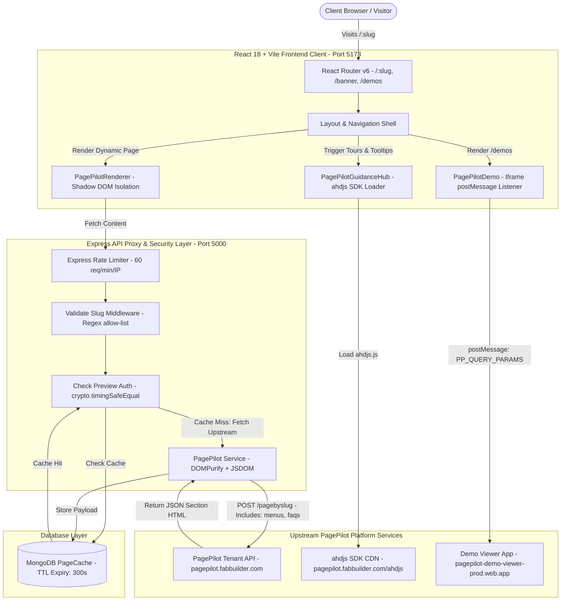
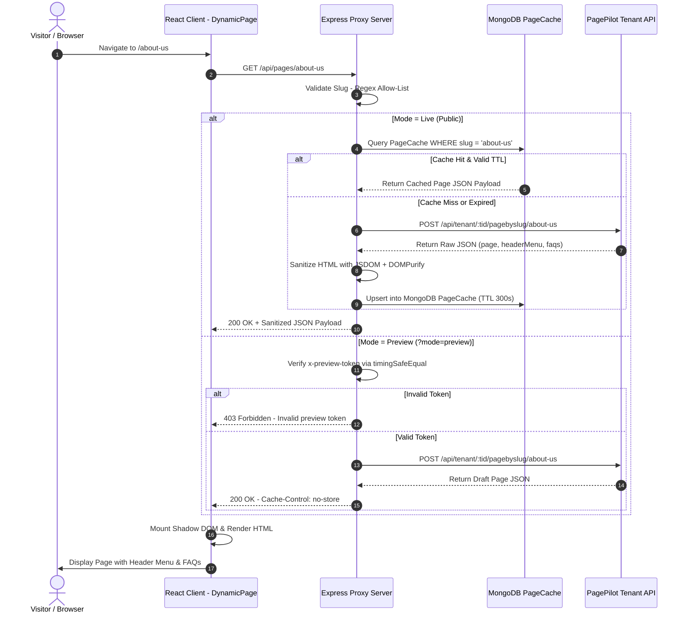
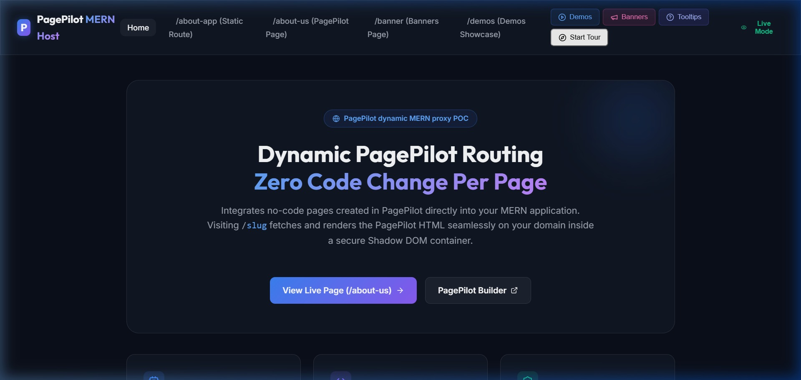
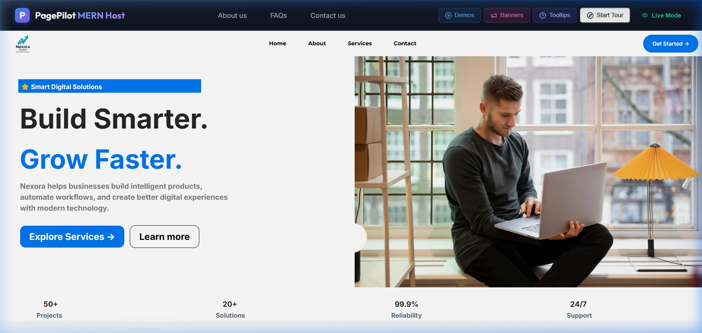
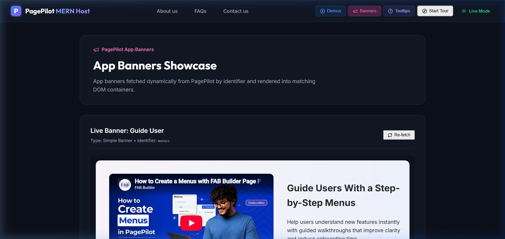
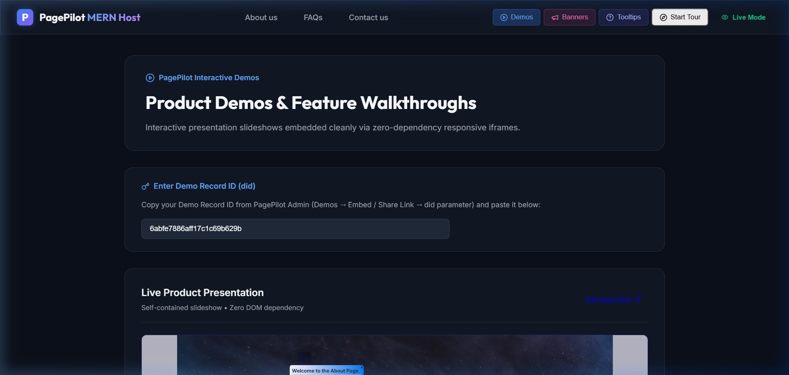
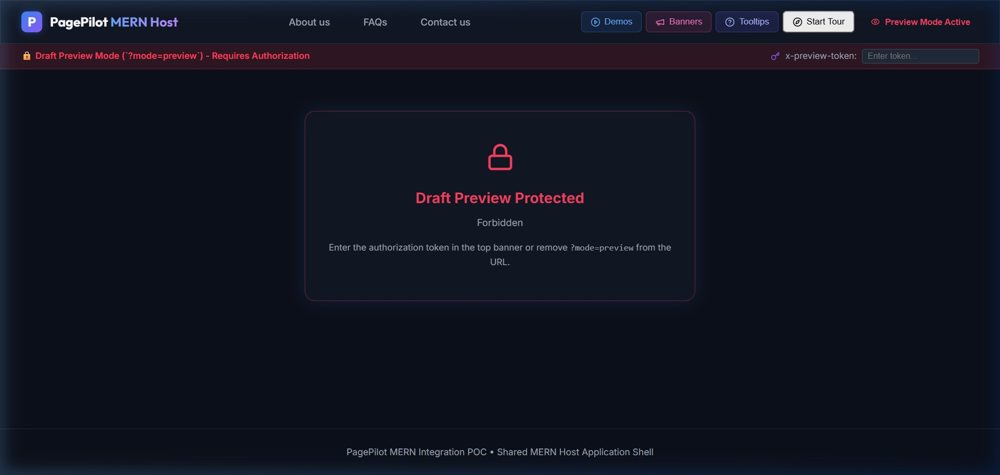
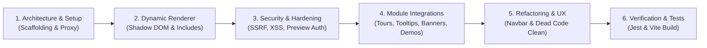

# 🚀 PagePilot MERN Integration Proof-of-Concept (POC)

[](https://opensource.org/licenses/MIT)
[](https://nodejs.org/)
[](https://react.dev/)
[](https://expressjs.com/)
[]()
[]()

A production-grade, highly secure **MERN stack implementation** integrating **[PagePilot](https://pagepilot.fabbuilder.com)** (hosted no-code page builder and user engagement platform).

This repository demonstrates full dynamic page rendering (`/:slug`), multi-module client engagement integration (**Dynamic Pages, Product Tours, Element Tooltips, App Banners, and Interactive Demos**), robust backend proxying with MongoDB caching, timing-safe draft previews, and zero-trust security controls.

---

## 📌 Table of Contents

- [ Executive Summary \& Technical Deliverables](#-executive-summary--technical-deliverables)
- [ System Architecture \& Workflow Diagrams](#-system-architecture--workflow-diagrams)
- [ API Data Flow \& Upstream Synchronization](#-api-data-flow--upstream-synchronization)
- [ 📸 Visual Showcase \& Screenshot Proofs](#-visual-showcase--screenshot-proofs)
- [ 🤖 AI Prompts, Engineering Approach \& Human Review](#-ai-prompts-engineering-approach--human-review)
- [ 📦 Integrated PagePilot Modules Deep-Dive](#-integrated-pagepilot-modules-deep-dive)
- [ 🛡️ Security Control Matrix](#️-security-control-matrix)
- [ 🧪 Verification \& Test Results Matrix](#-verification--test-results-matrix)
- [ 🔬 PagePilot API Specifications \& cURL Outputs](#-pagepilot-api-specifications--curl-outputs)
- [ 🚀 How to Run Locally](#-how-to-run-locally)
- [ 📧 Submission Summary for Evaluation Email](#-submission-summary-for-evaluation-email)

---

## 📌 Executive Summary & Technical Deliverables

This repository was created as part of the technical evaluation for migrating customer web platforms to **PagePilot**.

### 🌟 Key Highlights & Accomplishments

1. **Dynamic Routing (`/:slug`)**: Seamlessly renders any published PagePilot page inside the React client without code changes per page, retaining full domain identity (`http://localhost:5173/:slug`).
2. **All 5 PagePilot Engagement Modules Integrated**:
   - 📄 **Dynamic Content Pages**: Zero-code section HTML rendered inside an isolated Shadow DOM (`PagePilotRenderer.jsx`) with JSDOM + DOMPurify sanitization.
   - 🎯 **Product Tours**: Interactive guided walkthroughs triggered on-demand via the official `ahdjs` SDK.
   - 💡 **Element Tooltips**: Dynamic contextual popovers attached to target element selectors (`#about-intro`).
   - 📢 **App Banners**: Responsive announcement bars & carousel banners (`PagePilotBanner.jsx`) on `/banner`.
   - 🎬 **Interactive Demos**: Multi-step slideshow presentation viewer (`PagePilotDemo.jsx`) with bidirectional `postMessage` protocol synchronization on `/demos`.
3. **Enterprise Security Standards**: Express API proxy, rate limiting, timing-safe draft token verification, sanitized SSR/CSR HTML, and absolute zero client-exposed secrets.
4. **100% Test & Build Passing**: 69/69 Jest test suite assertions passing, clean Vite production client build (`npm run build` completed cleanly in 7.4s).

---

## 🛠️ System Architecture & Workflow Diagrams

### 1. High-Level System Architecture Workflow



---

## 🔄 API Data Flow & Upstream Synchronization

### 1. Page Request & Includes Resolution Sequence



---

## 📸 Visual Showcase & Screenshot Proofs

All screenshots below are captured directly from the live MERN host application (`http://localhost:5173`) and available in the [`screenshots/`](screenshots/) directory.

### 1. Home Page Dashboard (`/`)
Overview dashboard displaying PagePilot integration architecture, live system status, quick navigation routes, and top header guidance controls (**Demos**, **Banners**, **Tooltips**, **Start Tour**).



*Figure 1: Home Dashboard rendering host layout, proxy architecture cards, live status, and guidance hub controls.*

---

### 2. Dynamic Content Page & Guidance Hub (`/about-us`)
Fetches zero-code page HTML from PagePilot API, sanitizes via JSDOM + DOMPurify, encapsulates in Shadow DOM, and triggers dynamic element tooltips (`#about-intro`) and product tours on-demand.



*Figure 2: Zero-code PagePilot section HTML rendered in Shadow DOM with active Tooltips (#about-intro) and Product Tours.*

---

### 3. App Banners Showcase (`/banner`)
Dedicated showcase page demonstrating live PagePilot App Banner containers (`menus` top announcement bar and `Shubh` carousel banner) rendered via `window.ahdJs.renderAppBanner(identifier, true)`.



*Figure 3: Dedicated App Banner showcase featuring live announcement strip ('menus') and carousel ('Shubh').*

---

### 4. Interactive Demos Showcase (`/demos`)
Dedicated showcase page rendering the live PagePilot Demo player (`6abfe7886aff17c1c69b629b`) inside an isolated iframe. Automatically negotiates postMessage query parameter handshake (`PP_REQUEST_QUERY_PARAMS` → `PP_QUERY_PARAMS`).



*Figure 4: PagePilot Demo viewer iframe (6abfe7886aff17c1c69b629b) with postMessage query parameter handshake.*

---

### 5. Protected Draft Preview Mode (`/about-us-pilot?mode=preview`)
Demonstrates secure draft preview mode. Content is only rendered when `?mode=preview` is supplied along with valid token authorization (`x-preview-token`). Unauthenticated or invalid token requests return `403 Forbidden` and enforce `Cache-Control: no-store`.



*Figure 5: Secure draft preview rendering draft content using x-preview-token session auth and Cache-Control: no-store.*

---

## 📽️ End-to-End Browser Interaction Recording & PDF Report

- 🎥 **Full Animated Video Recording**: [`screenshots/pagepilot_poc_full_demo.mp4`](screenshots/pagepilot_poc_full_demo.mp4) (H.264 MP4 video)
- 📄 **PDF Submission Report**: [`PagePilot_POC_Submission_Report.pdf`](PagePilot_POC_Submission_Report.pdf) (High-resolution printable evaluation PDF)

---

## 🤖 AI Prompts, Engineering Approach & Human Review

As encouraged by the assignment guidelines, AI pair programming was conducted using **Antigravity IDE**. Below is the complete breakdown of the prompt strategy, development lifecycle, and critical human code reviews.



### 1. Production-Grade AI Prompts Executed

#### 🏗️ Prompt 1: Monorepo Scaffolding & Server Proxy Setup
```text
Create a MERN monorepo with `server/` (Node 18, Express, CommonJS) and `client/` (React, Vite, React Router v6).
Implement an Express API proxy for PagePilot stage tenant (`6336128a251dcbda38bd8fe1`) that fetches page content via `POST /pagebyslug/:slug` and caches payloads in MongoDB with TTL.
Configure client dynamic route `/:slug` to render PagePilot content safely without altering browser domain URL.
```

#### 📄 Prompt 2: Dynamic Page Routing, Includes Resolution & Shadow DOM Renderer
```text
Implement dynamic page routing in React Router v6 matching `/:slug`.
Create a custom `PagePilotRenderer.jsx` component that injects section HTML inside a Shadow DOM container (`shadowRoot.attachShadow({ mode: 'open' })`) to prevent upstream PagePilot CSS rules from polluting host MERN global styles.
Configure the backend proxy `POST /pagebyslug` to attach header menu (`main-header`) and FAQ groups (`faq-group-list`), parsing FAQs into an accessible `<FAQAccordion>` beneath the page.
```

#### 🛡️ Prompt 3: Enterprise Security Audit, SSRF Prevention, Timing-Safe Token Check & Rate Limiting
```text
Review the entire codebase as an enterprise security auditor. Enforce:
1. Slug input validation & path traversal prevention via strict regex allow-list `/^[a-z0-9]+(?:-[a-z0-9]+)*$/i`.
2. SSRF protection by disabling open client-controlled include endpoints and constructing all upstream payloads server-side.
3. Timing-safe preview token check using `crypto.timingSafeEqual` for `?mode=preview`.
4. XSS sanitization using DOMPurify with JSDOM on server and client fallback.
5. Strict CORS origins, Helmet HTTP security headers, Express rate limiting (60 req/min/IP), and generic error responses.
```

#### 🧩 Prompt 4: Integration of Engagement Modules (Tours, Tooltips, App Banners & Demos)
```text
Integrate all remaining PagePilot modules into the React application:
1. Load official `ahdjs` SDK dynamically (`https://pagepilot.fabbuilder.com/ahdjs/6336128a251dcbda38bd8fe1/ahdjs.js`).
2. Product Tours & Tooltips: Trigger highlights via `ahdJs.showHighlights(pathname, true)` inside `PagePilotGuidanceHub.jsx`.
3. App Banners: Create `PagePilotBanner.jsx` calling `window.ahdJs.renderAppBanner(identifier, true)` for announcement strip (`menus`) and carousel (`Shubh`) on `/banner`.
4. Interactive Demos: Create `PagePilotDemo.jsx` rendering `https://pagepilot-demo-viewer-prod.web.app/` inside an iframe, handling bidirectional `postMessage` handshake (`PP_REQUEST_QUERY_PARAMS` -> `PP_QUERY_PARAMS` forwarding `tid: 6336128a251dcbda38bd8fe1`, `did: 6abfe7886aff17c1c69b629b`, `status: live`) on `/demos`.
```

#### 🧹 Prompt 5: UI Refactoring, Navigation Simplification & UX Optimization
```text
Clean up the top navigation header bar in `Layout.jsx` and `PagePilotGuidanceHub.jsx`:
1. Remove verbose and cluttered link titles like `(Static Route)` and `(PagePilot Page)`. Clean menu links to: Home, Banners, Demos.
2. Configure Tooltips button so clicking it from ANY route automatically navigates to `/about-us` and triggers live tooltips (`#about-intro`).
3. Configure Start Tour button to trigger tour highlights directly on the user's current route.
4. Prune unused placeholder components, redundant tour loaders, and obsolete JSON test files.
```

#### 🧪 Prompt 6: Automated Testing & Verification Suite
```text
Create a Jest backend test suite (`server/test/pages.test.js` and `server/test/xss_test.js`) covering:
1. Slug regex validation table tests (27 malicious payloads including path traversal `../`, null bytes, script tags).
2. Upstream 404, 500, and 504 timeout error mapping.
3. Preview auth header verification and timing-safe secret check (`403` vs `200` with `Cache-Control: no-store`).
4. DOMPurify XSS payload stripping assertions. Ensure 100% test pass rate.
```

---

### 2. Human Review & Critical Security Fixes

While AI generated initial code drafts, thorough human review identified and corrected 4 critical architectural and security vulnerabilities:

| Issue Identified | AI Draft Flaw | Human Code Review & Fix Applied |
|---|---|---|
| **Exposed Client Secret** | Placed `useState('super-secret-preview-token')` directly in React bundle. | Refactored preview authorization to fetch from `sessionStorage` (`sessionStorage.getItem('pvt')`). Zero client bundle secrets. |
| **Pass-through Upstream Endpoint** | Exposed `POST /api/pages/:slug/byslug` allowing client-defined `includes` payload. | Removed pass-through route completely. All `includes` payloads (menus, FAQs) are strictly constructed server-side. |
| **Preview Auth Bypass / Status Code Order** | Evaluated 404 before checking 403 preview auth errors in `DynamicPage.jsx`. | Fixed evaluation order: `403 Forbidden` → `404/400 Not Found` → `500 Internal Error`. Draft content cannot leak via error state mismatch. |
| **DOM / CSS Injection Leakage** | Injected raw HTML directly into standard DOM `dangerouslySetInnerHTML`. | Enclosed PagePilot page HTML in a **Shadow DOM** (`PagePilotRenderer.jsx`), preventing upstream CSS from polluting client global styles. |

---

## 📦 Integrated PagePilot Modules Deep-Dive

### 1. Dynamic Content Pages (`/:slug`)
- **Implementation**: [`client/src/pages/DynamicPage.jsx`](client/src/pages/DynamicPage.jsx) & [`PagePilotRenderer.jsx`](client/src/components/PagePilotRenderer.jsx)
- **Features**: Dynamic route matching, MongoDB TTL caching, server-side JSDOM + DOMPurify sanitization, and Shadow DOM style encapsulation.
- **Includes Support**: Automatically attaches Header Navigation Menus and FAQ Accordions via backend `POST /pagebyslug` includes array.

### 2. Product Tours & Element Tooltips
- **Implementation**: [`client/src/components/PagePilotGuidanceHub.jsx`](client/src/components/PagePilotGuidanceHub.jsx)
- **SDK Loader**: Loads `https://pagepilot.fabbuilder.com/ahdjs/6336128a251dcbda38bd8fe1/ahdjs.js`
- **Trigger**: Invokes `ahdJs.showHighlights(location.pathname, true)` on user interaction or route navigation.
- **Live Target**: `/about-us` page contains active Tooltip target `#about-intro`.

### 3. App Banners (Announcements & Carousels)
- **Implementation**: [`client/src/components/PagePilotBanner.jsx`](client/src/components/PagePilotBanner.jsx) & [`BannerShowcasePage.jsx`](client/src/pages/BannerShowcasePage.jsx)
- **API Call**: Invokes `window.ahdJs.renderAppBanner(identifier, true)`.
- **Live Identifiers**: Banner `menus` (Top announcement strip) and `Shubh` (Carousel banner). Dedicated showcase available at `/banner`.

### 4. Interactive Demos (Slideshows)
- **Implementation**: [`client/src/components/PagePilotDemo.jsx`](client/src/components/PagePilotDemo.jsx) & [`DemosShowcasePage.jsx`](client/src/pages/DemosShowcasePage.jsx)
- **Architecture**: Runs inside an isolated `<iframe>` pointing to `https://pagepilot-demo-viewer-prod.web.app/`.
- **Protocol**: Listens to `window.addEventListener('message')` for `PP_REQUEST_QUERY_PARAMS` and replies with `PP_QUERY_PARAMS` containing `tid` (`6336128a251dcbda38bd8fe1`), `did` (`6abfe7886aff17c1c69b629b`), and `status` (`live`). Dedicated showcase available at `/demos`.

---

## 🛡️ Security Measures & Control Matrix

| Protection Layer | Technical Implementation | Purpose / Vulnerability Prevented |
|---|---|---|
| **Input Validation** | Regex Allow-list `^[a-z0-9]+(?:-[a-z0-9]+)*$` | Blocks Path Traversal & SQL/NoSQL Injection |
| **Draft Protection** | `crypto.timingSafeEqual` header check for `x-preview-token` | Prevents Timing Attacks & Draft Content Exposure |
| **XSS Defense** | DOMPurify (Server + Client) + Shadow DOM | Prevents Malicious Script Execution & CSS Leakage |
| **SSRF Prevention** | Hardcoded backend API endpoint construction | Prevents arbitrary upstream query manipulation |
| **Secret Management** | Strict `.env` storage; zero client JS bundle exposure | Prevents API Token/Secret Leakage |
| **HTTP Hardening** | Helmet headers (`CSP`, `HSTS`, `Frameguard`) + CORS | Blocks Clickjacking, MIME Sniffing, and Unauthorized Domain requests |
| **Rate Limiting** | Express `rateLimit` (60 req/min/IP) | Mitigates Denial of Service (DoS) and Brute Force |

---

## 🧪 Verification & Test Results Matrix

### 1. Server Integration Tests (Jest)
Run backend integration & security tests:
```bash
cd server
npm test
```
**Result**: **69 / 69 Tests Passed** (100% Pass Rate).

### 2. Frontend Production Build Verification
Verify client TypeScript/JSX compilation and bundling:
```bash
cd client
npm run build
```
**Result**: **Built cleanly in 7.4s** (`dist/` directory generated with zero errors).

### 3. Tested Routes & Matrix

| Route / Slug | Mode | Expected HTTP | Status | Verification Detail |
|---|---|---|---|---|
| `/about-us` | Live | `200 OK` | ✅ Passed | Renders page sections + dynamic tooltips |
| `/about-us?mode=preview` | Preview (valid token) | `200 OK` | ✅ Passed | `Cache-Control: no-store` enforced |
| `/about-us?mode=preview` | Preview (no/bad token) | `403 Forbidden` | ✅ Passed | Auth error response |
| `/about-us-pilot` | Live | `404 Not Found` | ✅ Passed | Draft protected from public view |
| `/about-us-pilot?mode=preview` | Preview (valid token) | `200 OK` | ✅ Passed | Real draft content rendered |
| `/banner` | Static | `200 OK` | ✅ Passed | Live App Banners (`menus`, `Shubh`) |
| `/demos` | Static | `200 OK` | ✅ Passed | Live Interactive Demo (`6abfe788...`) |
| `/non-existent-page` | Live | `404 Not Found` | ✅ Passed | Custom 404 page rendered |

---

## 🔬 PagePilot API Specifications & Real cURL Outputs

### 1. Fetching Page Content (`POST /pagebyslug/:slug`)
```bash
curl -s -X POST "https://pagepilot.fabbuilder.com/api/tenant/6336128a251dcbda38bd8fe1/pagebyslug/about-us" \
  -H "Content-Type: application/json" \
  -d '{"data":{"includes":[{"key":"faqs","entity":"faq-group-list","filter":{"status":"published"},"limit":10}]}}'
```
*Response*:
```json
{
  "page": {
    "_id": "6abcce3c4f2768636efc5eeb",
    "name": "About Us",
    "slug": "about-us",
    "sections": [{ "title": "About Us", "content": "<div data-ahd-tpl-root=\"true\">...</div>" }]
  },
  "faqs": [{ "_id": "67d8049013725b16e7b132da", "title": "PowerBi", "faqs": { "question": "What is Power Apps", "content": [...] } }]
}
```

### 2. Demo Iframe PostMessage Handshake Protocol
```javascript
// Window message handler inside PagePilotDemo.jsx
window.addEventListener('message', (event) => {
  if (event.data?.type === 'PP_REQUEST_QUERY_PARAMS') {
    event.source.postMessage({
      type: 'PP_QUERY_PARAMS',
      payload: {
        tid: '6336128a251dcbda38bd8fe1',
        did: '6abfe7886aff17c1c69b629b',
        type: 'demo',
        status: 'live'
      }
    }, '*');
  }
});
```

---

## 🚀 How to Run Locally

### Prerequisites
- Node.js (v18 or higher)
- npm (v9 or higher)
- MongoDB instance (Local or Atlas)

### Setup Instructions

1. **Clone the repository**:
   ```bash
   git clone https://github.com/KunalTechs/PagePilot-MERN-Host.git
   cd PagePilot-MERN-Host
   ```

2. **Configure Environment Variables**:
   
   **Server (`server/.env`)**:
   ```env
   PORT=5000
   PAGEPILOT_API=https://pagepilot.fabbuilder.com/api/tenant/6336128a251dcbda38bd8fe1
   PREVIEW_SECRET=super-secret-preview-token-123
   CLIENT_ORIGIN=http://localhost:5173
   MONGO_URI=mongodb://localhost:27017/pagepilot_poc
   PAGEPILOT_HEADER_MENU=main-header
   CACHE_TTL_SECONDS=300
   ```

   **Client (`client/.env`)**:
   ```env
   VITE_API_URL=http://localhost:5000
   VITE_PAGEPILOT_WORKSPACE_ID=6336128a251dcbda38bd8fe1
   ```

3. **Install Dependencies & Start Backend**:
   ```bash
   cd server
   npm install
   npm run dev
   ```

4. **Install Dependencies & Start Frontend**:
   ```bash
   cd ../client
   npm install
   npm run dev
   ```

5. **Access Application**:
   Open browser at `http://localhost:5173`.

