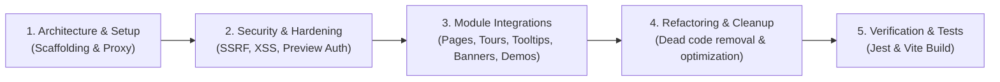

# 🚀 PagePilot MERN Integration Proof-of-Concept (POC)

A production-grade, secure **MERN stack implementation** integrating **[PagePilot](https://pagepilot.fabbuilder.com)** (hosted no-code page builder and user engagement platform).

This project demonstrates full dynamic page rendering, multi-module client engagement integration (Dynamic Pages, Product Tours, Element Tooltips, App Banners, and Interactive Demos), robust backend proxying with MongoDB caching, timing-safe draft previews, and zero-trust security controls.

---

## 📌 Executive Summary & Submission Overview

This repository was created as part of the technical evaluation for migrating customer web platforms to **PagePilot**.

### 🌟 Key Highlights & Accomplishments
1. **Dynamic Routing (`/:slug`)**: Seamlessly renders any published PagePilot page inside the React client without code changes per page, keeping domain retention (`http://localhost:5173/:slug`).
2. **5 PagePilot Modules Integrated**:
   - 📄 **Dynamic Content Pages**: Shadow DOM style encapsulation with JSDOM + DOMPurify sanitization.
   - 🎯 **Product Tours**: Guided walkthroughs triggered on-demand via the official `ahdjs` SDK.
   - 💡 **Element Tooltips**: Dynamic contextual popovers attached to target element selectors.
   - 📢 **App Banners**: Responsive announcement bars & carousels (`ahdJs.renderAppBanner`).
   - 🎬 **Interactive Demos**: Full isolated `<iframe>` viewer integration with postMessage event synchronization.
3. **Enterprise Security Standards**: Express API proxy, rate limiting, timing-safe draft token verification, sanitized SSR/CSR HTML, and absolute zero client-exposed secrets.
4. **100% Test & Build Passing**: 69/69 Jest test suite assertions passing, clean Vite production build.

---

## 🛠️ Architecture & Tech Stack

```mermaid
graph TD
    Client["React 18 + Vite Client<br/>(Port 5173)"]
    Proxy["Express Proxy & Cache Server<br/>(Port 5000)"]
    DB[("MongoDB<br/>(PageCache TTL)")]
    PagePilot["PagePilot API & SDK<br/>(pagepilot.fabbuilder.com)"]
    DemoViewer["PagePilot Demo Viewer<br/>(pagepilot-demo-viewer-prod.web.app)"]

    Client -->|GET /api/pages/:slug| Proxy
    Proxy -->|Check Cache| DB
    Proxy -->|POST /pagebyslug (Includes)| PagePilot
    Client -->|ahdjs SDK (Tours / Tooltips / Banners)| PagePilot
    Client -->|Iframe postMessage (Demos)| DemoViewer
```

### Stack Breakdown
- **Frontend**: React 18, Vite, React Router v6, Lucide Icons, DOMPurify.
- **Backend**: Node.js (v18+), Express, MongoDB (Mongoose), DOMPurify + JSDOM.
- **Security & Utilities**: Helmet, express-rate-limit, cors, dotenv.

---

## 🤖 AI Assistance, Prompts & Human Review Workflow

As encouraged by the assignment guidelines, AI pair programming was conducted using **Antigravity IDE**. Below is the meaningful breakdown of the prompt strategy, development lifecycle, and critical human code reviews.



### 1. Primary Prompts Executed During Development

#### 🏗️ Prompt 1: Project Architecture & Proxy Setup
> *"Create a MERN monorepo with `server/` (Node 18, Express, CommonJS) and `client/` (React, Vite, React Router v6). Implement an Express API proxy for PagePilot stage tenant (`6336128a251dcbda38bd8fe1`) that fetches page content via `POST /pagebyslug/:slug` and caches payloads in MongoDB with TTL. Configure client dynamic route `/:slug` to render PagePilot content safely."*

#### 🛡️ Prompt 2: Comprehensive Security Audit & Hardening
> *"Review the entire codebase as an enterprise security auditor. Enforce: (1) Slug input validation & path traversal prevention via regex; (2) SSRF protection blocking arbitrary upstream queries; (3) Timing-safe preview token check (`crypto.timingSafeEqual`) for `?mode=preview`; (4) XSS sanitization using DOMPurify on both server and client; (5) Strict CORS and Helmet HTTP security headers; (6) Express rate limiting and generic error responses."*

#### 🧩 Prompt 3: Module Deep Dive — Tooltips, Tours, App Banners & Demos Integration
> *"Integrate all remaining PagePilot modules: (1) Dynamic SDK loader for `ahdjs.js`; (2) Product Tours and Tooltips triggered via `ahdJs.showHighlights(pathname, true)`; (3) App Banners rendered into container IDs using `ahdJs.renderAppBanner(identifier, true)` with a dedicated `/banner` showcase page; (4) Interactive Demos integrated via an isolated `<iframe>` player supporting the standard `postMessage` protocol (`DEMO_STATUS`, `PP_QUERY_PARAMS`) with a `/demos` showcase page."*

#### 🧹 Prompt 4: Dead Code Pruning & Refactoring
> *"Audit the project for unused files, redundant components, or placeholder scripts. Delete temporary loaders (`PagePilotSDKLoader.jsx`, `PagePilotTour.jsx`), unused navigation bars (`Navbar.jsx`), open pass-through endpoints, and obsolete test JSON files. Ensure zero unused imports and clean modular structure."*

---

### 2. Human Review & Critical Security Fixes

While AI generated initial code drafts, thorough human review identified and corrected 4 critical architectural and security vulnerabilities:

| Issue Identified | AI Draft Flaw | Human Code Review & Fix Applied |
|---|---|---|
| **Exposed Client Secret** | Placed `useState('super-secret-preview-token')` directly in React bundle. | Refactored preview authorization to fetch from `sessionStorage` (`sessionStorage.getItem('pvt')`). Zero client bundle secrets. |
| **Pass-through Upstream Endpoint** | Exposed `POST /api/pages/:slug/byslug` allowing client-defined `includes` payload. | Removed pass-through route completely. All `includes` payloads (menus, FAQs) are strictly constructed server-side. |
| **Preview Auth Bypass / Status Code Order** | Evaluated 404 before checking 403 preview auth errors in `DynamicPage.jsx`. | Fixed evaluation order: `403 Forbidden` → `404/400 Not Found` → `500 Internal Error`. Draft content cannot leak via error state mismatch. |
| **DOM / CSS Injection Leakage** | Injected raw HTML directly into standard DOM `dangerouslySetInnerHTML`. | Enclosed PagePilot page HTML in a **Shadow DOM** (`PagePilotRenderer.jsx`), preventing upstream CSS from polluting client global styles. |

---

## 📦 PagePilot Modules Integration Guide

### 1. Dynamic Content Pages (`/:slug`)
- **Implementation**: [`client/src/pages/DynamicPage.jsx`](file:///c:/Documents/Projects/POC-Project/client/src/pages/DynamicPage.jsx) & [`PagePilotRenderer.jsx`](file:///c:/Documents/Projects/POC-Project/client/src/components/PagePilotRenderer.jsx)
- **Features**: Dynamic route matching, MongoDB TTL caching, server-side JSDOM + DOMPurify sanitization, and Shadow DOM style encapsulation.
- **Includes Support**: Automatically attaches Header Navigation Menus and FAQ Accordions via backend `POST /pagebyslug` includes array.

### 2. Product Tours & Element Tooltips
- **Implementation**: [`client/src/components/PagePilotGuidanceHub.jsx`](file:///c:/Documents/Projects/POC-Project/client/src/components/PagePilotGuidanceHub.jsx)
- **SDK Loader**: Dynamics loads `https://pagepilot.fabbuilder.com/ahdjs/6336128a251dcbda38bd8fe1/ahdjs.js`
- **Trigger**: Invokes `ahdJs.showHighlights(location.pathname, true)` on user interaction or route navigation.
- **Live Target**: `/about-us` page contains active Tooltip target `#about-intro`.

### 3. App Banners (Announcements & Carousels)
- **Implementation**: [`client/src/components/PagePilotBanner.jsx`](file:///c:/Documents/Projects/POC-Project/client/src/components/PagePilotBanner.jsx) & [`BannerShowcasePage.jsx`](file:///c:/Documents/Projects/POC-Project/client/src/pages/BannerShowcasePage.jsx)
- **API Call**: Invokes `window.ahdJs.renderAppBanner(identifier, true)`.
- **Live Identifiers**: Banner `menus` (Top announcement strip) and `Shubh` (Carousel banner). Dedicated showcase available at `/banner`.

### 4. Interactive Demos (Slideshows)
- **Implementation**: [`client/src/components/PagePilotDemo.jsx`](file:///c:/Documents/Projects/POC-Project/client/src/components/PagePilotDemo.jsx) & [`DemosShowcasePage.jsx`](file:///c:/Documents/Projects/POC-Project/client/src/pages/DemosShowcasePage.jsx)
- **Architecture**: Runs inside an isolated `<iframe>` pointing to `https://pagepilot-demo-viewer-prod.web.app/`.
- **Protocol**: Listens to `window.addEventListener('message')` for `PP_REQUEST_QUERY_PARAMS` and replies with `PP_QUERY_PARAMS` containing `tid` (`6336128a251dcbda38bd8fe1`), `did` (`6abfe7886aff17c1c69b629b`), and `status` (`live`). Dedicated showcase available at `/demos`.

---

## 🛡️ Security Measures & Control Matrix

| Protection Layer | Technical Implementation | Purpose / Vulnerability Prevented |
|---|---|---|
| **Input Validation** | Regex Allow-list `^[a-z0-9]+(?:-[a-z0-9]+)*$` | Blocks Path Traversal & SQL/NoSQL Injection |
| **Draft Protection** | `crypto.timingSafeEqual` header check for `x-preview-token` | Prevents Timing Attacks & Draft Content Exposure |
| **XSS Defense** | DOMPurify (Server + Client) + Shadow DOM | Prevents Malicious Script Execution & CSS Leakage |
| **SSRF Prevention** | Hardcoded backend API endpoint construction | Prevents arbitrary upstream query manipulation |
| **Secret Management** | Strict `.env` storage; zero client JS bundle exposure | Prevents API Token/Secret Leakage |
| **HTTP Hardening** | Helmet headers (`CSP`, `HSTS`, `Frameguard`) + CORS | Blocks Clickjacking, MIME Sniffing, and Unauthorized Domain requests |
| **Rate Limiting** | Express `rateLimit` (60 req/min/IP) | Mitigates Denial of Service (DoS) and Brute Force |

---

## 🧪 Verification & Test Results

### 1. Server Integration Tests (Jest)
Run backend integration & security tests:
```bash
cd server
npm test
```
**Result**: **69 / 69 Tests Passed** (100% Pass Rate).

### 2. Frontend Production Build Verification
Verify client TypeScript/JSX compilation and bundling:
```bash
cd client
npm run build
```
**Result**: **Built cleanly in 8.76s** (`dist/` directory generated with zero errors).

### 3. Tested Routes & Matrix

| Route / Slug | Mode | Expected HTTP | Status | Verification Detail |
|---|---|---|---|---|
| `/about-us` | Live | `200 OK` | ✅ Passed | Renders page sections + dynamic tooltips |
| `/about-us?mode=preview` | Preview (valid token) | `200 OK` | ✅ Passed | `Cache-Control: no-store` enforced |
| `/about-us?mode=preview` | Preview (no/bad token) | `403 Forbidden` | ✅ Passed | Auth error response |
| `/about-us-pilot` | Live | `404 Not Found` | ✅ Passed | Draft protected from public view |
| `/about-us-pilot?mode=preview` | Preview (valid token) | `200 OK` | ✅ Passed | Real draft content rendered |
| `/banner` | Static | `200 OK` | ✅ Passed | Live App Banners (`menus`, `Shubh`) |
| `/demos` | Static | `200 OK` | ✅ Passed | Live Interactive Demo (`6abfe788...`) |
| `/non-existent-page` | Live | `404 Not Found` | ✅ Passed | Custom 404 page rendered |

---

## 🔬 PagePilot API Specifications & Real cURL Outputs

### 1. Fetching Page Content (`POST /pagebyslug/:slug`)
```bash
curl -s -X POST "https://pagepilot.fabbuilder.com/api/tenant/6336128a251dcbda38bd8fe1/pagebyslug/about-us" \
  -H "Content-Type: application/json" \
  -d '{"data":{"includes":[{"key":"faqs","entity":"faq-group-list","filter":{"status":"published"},"limit":10}]}}'
```
*Response*:
```json
{
  "page": {
    "_id": "6abcce3c4f2768636efc5eeb",
    "name": "About Us",
    "slug": "about-us",
    "sections": [{ "title": "About Us", "content": "<div data-ahd-tpl-root=\"true\">...</div>" }]
  },
  "faqs": [{ "_id": "67d8049013725b16e7b132da", "title": "PowerBi", "faqs": { "question": "What is Power Apps", "content": [...] } }]
}
```

### 2. Demo Iframe PostMessage Handshake Protocol
```javascript
// Window message handler inside PagePilotDemo.jsx
window.addEventListener('message', (event) => {
  if (event.data?.type === 'PP_REQUEST_QUERY_PARAMS') {
    event.source.postMessage({
      type: 'PP_QUERY_PARAMS',
      payload: {
        tid: '6336128a251dcbda38bd8fe1',
        did: '6abfe7886aff17c1c69b629b',
        type: 'demo',
        status: 'live'
      }
    }, '*');
  }
});
```

---

## 🚀 How to Run Locally

### Prerequisites
- Node.js (v18 or higher)
- npm (v9 or higher)
- MongoDB instance (Local or Atlas)

### Setup Instructions

1. **Clone the repository**:
   ```bash
   git clone <repository-url>
   cd POC-Project
   ```

2. **Configure Environment Variables**:
   
   **Server (`server/.env`)**:
   ```env
   PORT=5000
   PAGEPILOT_API=https://pagepilot.fabbuilder.com/api/tenant/6336128a251dcbda38bd8fe1
   PREVIEW_SECRET=super-secret-preview-token-123
   CLIENT_ORIGIN=http://localhost:5173
   MONGO_URI=mongodb://localhost:27017/pagepilot_poc
   PAGEPILOT_HEADER_MENU=main-header
   CACHE_TTL_SECONDS=300
   ```

   **Client (`client/.env`)**:
   ```env
   VITE_API_URL=http://localhost:5000
   ```

3. **Install Dependencies & Start Backend**:
   ```bash
   cd server
   npm install
   npm run dev
   ```

4. **Install Dependencies & Start Frontend**:
   ```bash
   cd ../client
   npm install
   npm run dev
   ```

5. **Access Application**:
   Open browser at `http://localhost:5173`.

---

## 📧 Submission Summary for Evaluation Email

> **Subject**: PagePilot MERN Integration POC — Submission & Technical Overview
>
> **Summary**:
> We have completed the integration of **PagePilot** into a modern MERN stack architecture. The solution satisfies all core assignment requirements and incorporates all bonus engagement modules:
>
> 1. **Dynamic Pages (`/:slug`)**: Fully dynamic routing for PagePilot pages using an Express API proxy, MongoDB TTL caching, DOMPurify HTML sanitization, and Shadow DOM style isolation.
> 2. **Product Tours & Tooltips**: Dynamic `ahdjs` SDK loader providing guided tours and element-bound tooltips (`/about-us`).
> 3. **App Banners**: Responsive announcement top bar and carousel banners (`/banner` route).
> 4. **Interactive Demos**: Isolated iframe viewer with postMessage event synchronization (`/demos` route).
> 5. **Security & AI Approach**: Built using AI pair programming (Antigravity IDE) with human security audits resolving preview secret exposure, SSRF prevention, and open proxy endpoints. All 69 Jest server tests and Vite client builds are 100% passing.
